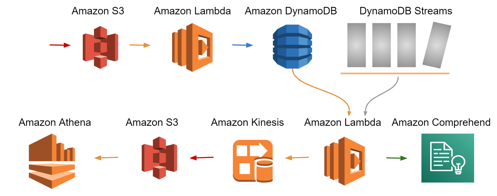

# Integrate Amazon DynamoDB table with machine learning for real-time sentiment analysis  
### TrendMarketPlace-Team-1 

This application is to check the sentiment on the incoming product review, creates a product review summary based on the sentiment, and keeps updates in optimized format for future ad hoc queries and analytics. We used a serverless event-driven architecture with automated steps by deploying the whole process on AWS CloudFormation.   



### I. The CloudFormation Part 1 stack  

The CloudFormation Part 1 stack creates the following resources:  
**1. A Glue database and table for cataloging**  
**2. Two Lambda functions and associated permissions**  
- First Lambda function reads the Amazon S3 events it receives as a parameter, determines where the review object is, reads the review object, and processes the records in the review object. The function breaks the incoming record into multiple records and DynamoDB items: a review item and product item (if it doesn’t already exist).     
```python
def get_records(session, bucket, key):
              """
              Generator for the bucket and key names of each CloudTrail log
              file contained in the event sent to this function from S3.
              (usually only one but this ensures we process them all).
              :param event: S3:ObjectCreated:Put notification event
              :return: yields bucket and key names
              """
              s3 = session.client('s3')
              response = s3.get_object(Bucket=bucket, Key=key)

              with io.BytesIO(response['Body'].read()) as obj:
                  with gzip.GzipFile(fileobj=obj) as logfile:
                      records = json.load(logfile)
                      return records

def handler(event, context):
    """
    Checks for API calls with RunInstances, TerminateInstances, and DeleteDBInstance in CloudTrail.
    if found, send specific records to SQS for processing

    :return: 200, success if records process successfully
    """
    session = boto3.session.Session()
    REGION = os.environ['AWS_REGION']
    print(REGION)
    dynamodb = boto3.resource("dynamodb", region_name=REGION)
    table = dynamodb.Table('AmazonReviews')

    # Get the S3 bucket and key for each log file contained in the event
    for event_record in event['Records']:
        try:
            bucket = event_record['s3']['bucket']['name']
            key = event_record['s3']['object']['key']
            print('Loading Amazon Reviews file s3://{}/{}'.format(bucket, key))
            records = get_records(session, bucket, key)
            print('Number of records in log file: {}'.format(len(records)))

            for record in records:
                response = table.get_item(Key={'pk': record['product_id'], 'sk': '2099-12-31#PRODUCTSUMMARY'})
                if 'Items' not in response:
                    table.put_item(
                        Item={
                            'pk': record['product_id'],
                            'sk': '2099-12-31#PRODUCTSUMMARY',
                            'marketplace': record['marketplace'],
                            'product_parent': record['product_parent'],
                            'product_title': record['product_title'],
                            'product_category': record['product_category'],
                        }
                    )
                table.put_item(
                    Item={
                        'pk': record['product_id'],
                        'sk': record['review_date'] + '#' + record['review_id'],
                        'customer_id': record['customer_id'],
                        'star_rating': record['star_rating'],
                        'helpful_votes': record['helpful_votes'],
                        'total_votes': record['total_votes'],
                        'vine': record['vine'],
                        'verified_purchase': record['verified_purchase'],
                        'review_headline': record['review_headline'],
                        'review_body': record['review_body']
                    }
                )
        except Exception as e:
            print (e)
            return {'Exception status': e}
        else:
            print("records processed successfully!!")

    return {
        'statusCode': 200,
        'body': json.dumps('records inserted successfully to DynamoDB!!')
    }
```
-  Second Lambda function captures the stream records from the stream and processes them one by one. This Lambda function has multiple responsibilities:  
a). Capture review text from the stream record and call Amazon Comprehend for sentimental analysis.  
b). Add the sentiment response for the review record and create a product review summary record with sentiment counts.  
c). Flatten the DynamoDB streaming JSON logs and add the record to the Kinesis Data Firehose delivery stream.  
d). Invoke the Firehose delivery stream put_record API for putting updates in the S3 bucket.
```python
import json
import boto3
import os

def convert_file(f):
    out = {}
    def convert(element, name=''):
        if type(element) is dict:
            for sub in element:
                convert(element[sub], name + sub + '_')
        elif type(element) is list:
            ctr = 0
            for sub in element:
                convert(sub, name + str(ctr) + '_')
                ctr += 1
        else:
            out[name[:-1]] = element
    convert(f)
    return out

def handler(event, context):
    REGION = os.environ['AWS_REGION']
    cmphd = boto3.client(service_name='comprehend', region_name=REGION)
    fh = boto3.client('firehose')
    ddb = boto3.resource('dynamodb', region_name=REGION)
    dt=ddb.Table('AmazonReviews')
    FIREHOSE_URL = os.environ['FIREHOSE_URL']
    for rec in event['Records']:
        if (rec['eventName'] == 'INSERT' and ('review_body' in rec['dynamodb']['NewImage'])):
            convt=convert_file(rec)
            response = fh.put_record(
                DeliveryStreamName=FIREHOSE_URL,
                Record={'Data': json.dumps(convt)}
            )
            review_body=rec['dynamodb']['NewImage']['review_body']['S']
            review_body=review_body[:4999]
            pk=rec['dynamodb']['Keys']['pk']['S']
            sk=rec['dynamodb']['Keys']['sk']['S']
            res=cmphd.detect_sentiment(Text=review_body, LanguageCode='en')
            st=res['Sentiment']
            try:
                d_response = dt.put_item(
                  Item={'pk': pk, 'sk': sk + '#' + 'SENTIMENT', 'sentiment': st}
                )
                if st == "POSITIVE":
                    d_s_response = dt.update_item(
                        Key={'pk': pk,'sk': '2099-12-31#REVIEWSUMMARY'},
                        UpdateExpression="set positive_sentiment_count= if_not_exists(positive_sentiment_count, :start) + :inc",ExpressionAttributeValues={':inc': 1,':start': 0},ReturnValues="UPDATED_NEW"
                    )
                elif st == "NEGATIVE":
                    d_s_response = dt.update_item(
                        Key={'pk': pk,'sk': '2099-12-31#REVIEWSUMMARY'},
                        UpdateExpression="set negative_sentiment_count= if_not_exists(negative_sentiment_count, :start) + :inc",ExpressionAttributeValues={':inc': 1,':start': 0},ReturnValues="UPDATED_NEW"
                    )
                elif st == "NEUTRAL":
                    d_s_response = dt.update_item(
                        Key={'pk': pk,'sk': '2099-12-31#REVIEWSUMMARY'},
                        UpdateExpression="set neutral_sentiment_count= if_not_exists(neutral_sentiment_count, :start) + :inc",ExpressionAttributeValues={':inc': 1,':start': 0},ReturnValues="UPDATED_NEW"
                    )
                elif st == "MIXED":
                    d_s_response = dt.update_item(
                        Key={'pk': pk,'sk': '2099-12-31#REVIEWSUMMARY'},
                        UpdateExpression="set mixed_sentiment_count= if_not_exists(mixed_sentiment_count, :start) + :inc",ExpressionAttributeValues={':inc': 1,':start': 0},ReturnValues="UPDATED_NEW"
                    )
                else:
                    print("No sentiment value: " + st)
            except Exception as e:
                return {'Exception status': e}
            else:
                print("record processed successfully")
```
The following screenshot shows sentiment item associated with review.  
  
**3. Required roles and policies**  
**4. CloudWatch LogStream and LogGroup**  
**5. Kinesis Firehose for sending streams data to S3 for analysis**    
**6. Two S3 buckets for incoming reviews and parquet output for analysis**   
**7. DynamoDB table and associated Streams**  

### II. The CloudFormation Part 2 stack  

The CloudFormation Part 2 stack imports the resources created and setup a managed policy.   
```
AWSTemplateFormatVersion: 2010-09-09
Description: "AWS Management Blog Addendum"
Resources:
  BlogManagedPolicy:
    Type: 'AWS::IAM::ManagedPolicy'
    Properties:
      PolicyDocument:
        Version: '2012-10-17'
        Statement:
          - Sid: AllowReadWrite
            Effect: Allow
            Action:
              - s3:Get*
              - s3:List*
              - s3:Put*
            Resource: !Join ["", ["arn:aws:s3:::",!ImportValue AmazonReviewsS3Bucket, "/*"]]
      Roles:
        - !ImportValue LambdaRoleForEventsProcessing
```


**THE END**
